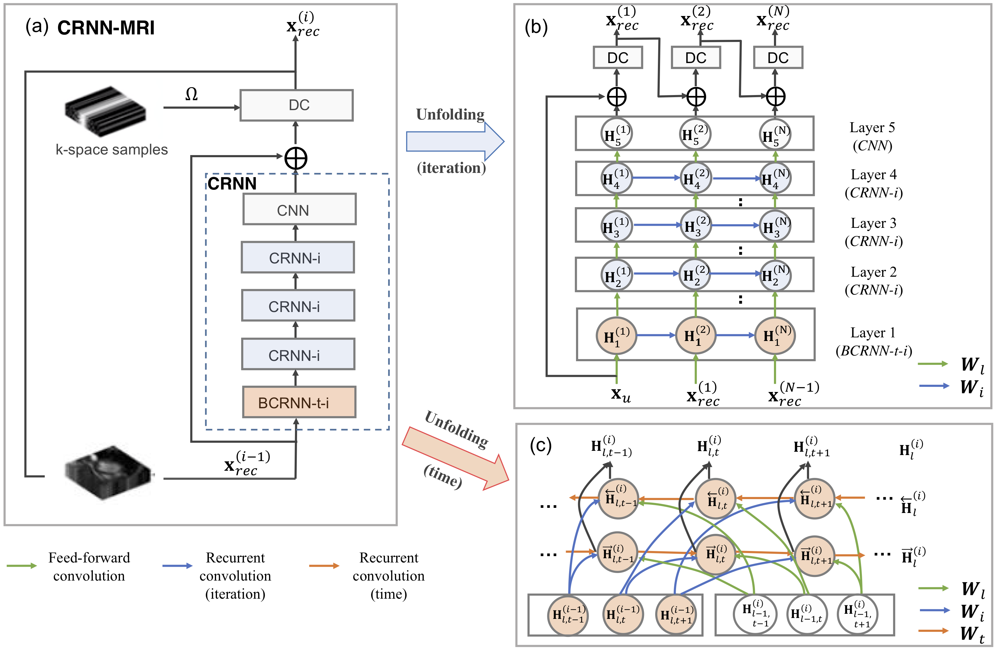

# Convolutional Recurrent Neural Networks for Dynamic MR Image Reconstruction

Code accompanying the TMI paper with the same title. Paper link: https://arxiv.org/abs/1712.01751

Please find the pytorch implementation of our work here: https://github.com/cq615/Deep-MRI-Reconstruction

## Usage

main_crnn.py ==> training demo for CRNN-MRI

cascadenet_pytorch ==> pytorch implementation of the CRNN-MRI model

=========================================================================

Reconstruct dynamic MR images from its undersampled measurements using 
Convolutional Recurrent Neural Networks. This is a pytorch implementation requiring 
Torch 0.4.  

Usage:

  python main_crnn.py --acceleration_factor 4

----

## Citation and Acknowledgement

If you use the code for your work, or if you found the code useful, please cite the following work:

C. Qin, J. Schlemper, J. Caballero, A. N. Price, J. V. Hajnal and D. Rueckert, "Convolutional Recurrent Neural Networks for Dynamic MR Image Reconstruction," in IEEE Transactions on Medical Imaging, vol. 38, no. 1, pp. 280-290, Jan. 2019, doi: 10.1109/TMI.2018.2863670.
